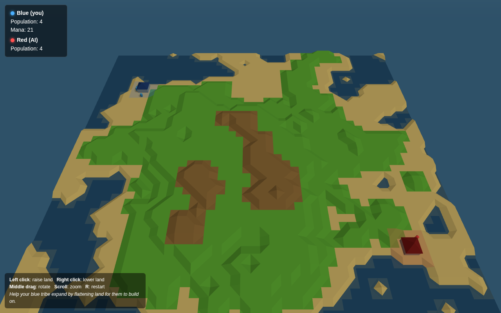

# Populous Clone

A browser clone of the classic god-game *Populous*, built with vanilla
JavaScript and [three.js](https://threejs.org/). Reshape a vertex-based
heightfield to help your blue tribe spread across the island and wipe out
the red AI.



## Quick start

The game uses ES modules and an import map, so it needs to be served over
HTTP — opening `index.html` directly with `file://` won't work.

```sh
cd populous
python3 -m http.server 8000
# then open http://localhost:8000/
```

Any static HTTP server works (`npx serve`, `caddy file-server`, etc.).
No build step, no dependencies to install — three.js is pulled from a CDN
via the import map in `index.html`.

## Controls

| Input             | Action                          |
|-------------------|---------------------------------|
| **Left click**    | Raise the targeted vertex       |
| **Right click**   | Lower the targeted vertex       |
| **Right drag**    | Pan the camera                  |
| **Middle drag**   | Orbit the camera                |
| **Scroll**        | Zoom                            |
| **R**             | Restart                         |

The yellow wireframe octahedron snaps to the grid corner under your mouse so
you can see exactly which vertex you'll affect.

See [`RULES.md`](RULES.md) for the full game mechanics — terrain smoothing,
walker AI, house-collapse rules, mana economy, and AI behaviour.

## What's implemented

- **Vertex-based heightfield** on a 48 × 48 grid (49 × 49 vertices), with
  BFS smoothing that enforces `|Δh| ≤ 1` between neighbouring vertices.
- **Triangulated sloped terrain** rendered with per-vertex colors and
  flat shading, diagonal chosen per cell to minimise saddle artifacts.
- **Walker AI**: build / move / attack / wander states; movement aborts on
  unwalkable cells (slopes > 1 step or under water).
- **Settlements** that collapse the instant any of their 9 footprint
  vertices is shifted — the canonical Populous mechanic.
- **Per-team mana** that grows with population and is spent on shaping.
- **A simple opposing god** that flattens around its walkers or raises
  hostile vertices between tribes.
- **Territory tint** painting cells with a slight team-color shade.
- A snapping vertex cursor, click-vs-drag detection, camera target clamp,
  win/lose state, and one-key restart.

## File layout

```
populous/
├── index.html    # DOM, HUD, three.js importmap
├── style.css     # HUD panels + centered message overlay
├── main.js       # All game code: terrain, walker, house, AI, input, loop
├── RULES.md      # Full mechanics reference
└── README.md     # This file
```

The whole game is intentionally kept in one `main.js` file (~600 lines) for
readability.

## Tech

- [three.js](https://threejs.org/) r160 (via jsDelivr CDN)
- `OrbitControls` from three.js examples
- No bundler, no transpiler, no package.json

## Tweaking

The most useful knobs are at the top of `main.js`:

```js
const GRID  = 48;    // map size in cells
const STEP  = 0.5;   // world units per integer height
const MAX_H = 8;     // max terrain level
```

Game-design knobs are scattered but easy to find — search for `cost`,
`capacity`, `speed`, or `spawnTimer` in `main.js`.
